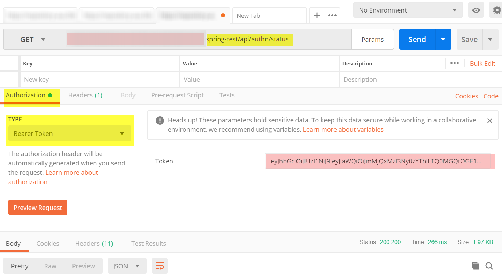


# Exercise 5: Interact with the submission process with Postman

In this exercise, we will interact with the submission process, from the submittion to the deposit of a new ite.  

For this exercise we will use two separate accounts, a basic submitter and the administrator

### 1a. Logout from the previous account

`api/authn/logout`

verify that your are not anymore authenticated

`api/authn/status`

In the return section, note that authentication is false.


### 1b. Login as a basic submitter

Similar to what done in [exercise4.md] login, this time using the following credentials: dspacedemo+submit@gmail.com / dspace

Note that the credentials you need to use will differ from the screenshot below.  

Note that the login endpoint should be invoked with the POST method.

POST `api/authn/login`


### 1c. Copy the Bearer token and add it to the Authentication section in Postman



### 1d. Re-verify your authentication status

`api/authn/status`

In the return section, note that authentication is true.


### Token/Session Duration

As long as you continue to use the tab that contains this Bearer token, you will continue to be authenticated.  If the Bearer token times out, repeat the steps above to generate a new one.

### 2. Start a new submission

Similarly to what done in [exercise 4](exercise4.md) we will create a new workspaceitem. This time we will start sending a pdf file to the server.

Again, in this process, you will perform the underlying tasks that the DSpace Angular client will perform on behalf of a user.

### 2a. Creating a Workspaceitem

POST `api/submission/workspaceitems?parent=51715dd3-5590-49f2-b227-6a663c849921`

Note the different Content-type used to inform the server about the attached PDF and the use of the parent parameter to force the use of a specifc collection. A sample pdf file can be [found here](https://github.com/DSpace/DSpace/blob/master/dspace-spring-rest/src/test/resources/org/dspace/app/rest/simple-article.pdf)

Note the id of the object that is created and the new upload section containing the information about the uploaded file 

Depending on the uploaded PDF file, if the server has the GrobId integration enabled, descriptive metadata could be automatically extracted and added to the item

### 2b. Add a DOI to the item

If your item doesn't contain yet a DOI add one with the following

PATCH `api/submission/workspaceitems/[id]`

using as body

```
  [
	{
	   "op":"add",
	   "path":"/sections/traditionalpageone/dc.identifier.doi", 
	   "value": [{"value": "10.1016/j.procs.2014.06.008"}]
	}
  ]
```

In the response, note the additional metadata automatically added to the item querying CrossRef (this requires to enable the crossref integration in the DSpace server adding valid API Key)

### 2c. Add a description to the file, reorder the authors and accept the license

The JSON PATCH allows to perform multiple operation as with a single atomic request/transaction.

PATCH `api/submission/workspaceitems/[id]`

Use the following json

```
[
	{"op":"move","from":"/sections/traditionalpageone/dc.contributor.author/1", "path":"/sections/traditionalpageone/dc.contributor.author/0"},
	{"op":"add","path":"/sections/upload/files/0/metadata/dc.description", "value":[{"value":"Description of the file"}]},
	{"op":"add","path":"/sections/license/granted", "value": true}
]
```

Look for the errors attribute, the item should be now ready for the deposit


### 2d. Complete the submission moving the workspaceitem to the workflow

You need to create a workflowitem from your workspaceitem, to do that send a reference to the workspaceitem to the workflowitems endpoint as text/uri-list

POST `api/workflow/workflowitems` -H Content-Type: "text/uri-list" --data '`{{dspaceresturl}}/api/submission/workspaceitems/[id]`' 

Note the workflowitem ID from the response

### 3. Perform the workflow

Follow the instruction at point 1 to logout as submitter  (not really required as long as you are sure to use the right authentication token) and login with the usual administrative account (this account is also configured in the official demo as Reviewer for the collection where we are submitting).

In this process, you will retrieve the task associated with the submitted item, claim and approve it publishing the item to the repository.

### 3a. Retrieve the Pool Task

In the real Angular UI the reviewer will use the discover endpoint to get a list of all her tasks with faceting capabilities and select the one that require her attention. To keep the task easier, in this exercise, we will retrieve the pool tasks available using a search method of the PoolTasks endpoint

POST `api/submission/pooltasks/search/findByUser?uuid=335647b6-8a52-4ecb-a8c1-7ebabb199bda`

the uuid in the parameter is the uuid of the administrator (reviewer) that we are currently loggedin. You can observe it in the response of the login method or looking to the User Data in the decoded JWT token (an online decoder is available on the [JWT website](https://jwt.io) 

Identify your task or just keep one among the available. Be fast other could grab your task :)
  

### 3b. Claim the task

To claim the task send a simple POST request to the pool task URI

POST `api/workflow/pooltasks/[id]`  -H Content-Type: "x-www-form-urlencoded"


### 3c. Retrieve the Claimed Task

Similarly to point 3a lookup for the claimed task ID

POST `api/submission/claimedtasks/search/findByUser=335647b6-8a52-4ecb-a8c1-7ebabb199bda`

Note the ID of the claimed task in the response

### 3d. Approve the task

You can now manipulate the embedded workflowitem using PATCH in the same way than was done for the workspaceitem. To complete the exercise simply approve the task

POST `api/workflow/claimedtasks/[id]?submit_approve=true`




